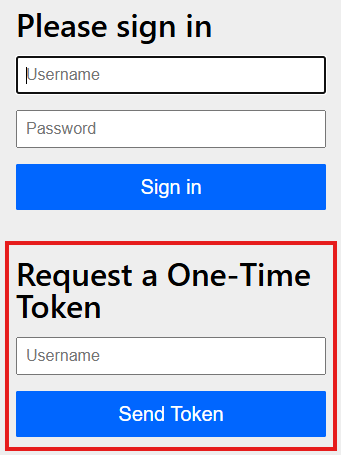
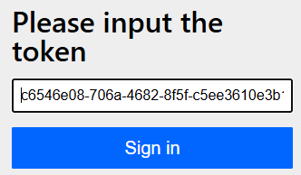

# OTT Application (One Time Token Login)

Este é um projeto Spring Boot que demonstra o uso de autenticação e login baseado em token único (One-Time Token - OTT).
A aplicação inclui funcionalidades básicas de autenticação e um endpoint seguro. Utiliza **InMemoryUserDetailsManager**
com fins didáticos.

## Funcionalidades

- **Login com token único (OTT):** Geração de um token de uso único exibido no console, utilizado para autenticação.
- **Autenticação via formulário do Spring Security:** Autenticação padrão através de um formulário.
- **Gerenciamento de usuários em memória:** Inclui dois usuários pré-configurados para demonstração.
- **Endpoint seguro:** Mostra o nome do usuário autenticado ao acessar.

## Tecnologias Utilizadas

- **Java 21+**
- **Spring Boot 3.4.0+**
- **Spring Security 6.4+**
- **BCrypt para codificação de senhas**
- **Maven** para gerenciar dependências**
- 

## Como Executar

1. Clone o repositório:
   ```bash
   git clone https://github.com/wagnerdba/ott-demo.git
   cd ott-demo

2. Execute a aplicação:
   ```bash
   mvn spring-boot:run
   ```
3. Acesse a aplicação:
    - Interface de autenticação: `http://localhost:8080`

## Usuários de Teste

### Usuário 1
- **Username:** `user1`
- **Password:** `123456`
- **Role:** `USER`

### Usuário 2
- **Username:** `user2`
- **Password:** `123456`
- **Role:** `USER`

## Fluxo do Login com Token Único (OTT)

1. Preencha um dos usuários no campo **Username** em **Request a One-Time Token**



2. No console, será exibido um token único com a seguinte mensagem:
   ```bash
   please go to http://localhost:8080/login/ott?token=<token-gerado>
3. Copie o link no console, cole no navegador e clique no botão **Sign in** e o usuário será autenticado.   
 


